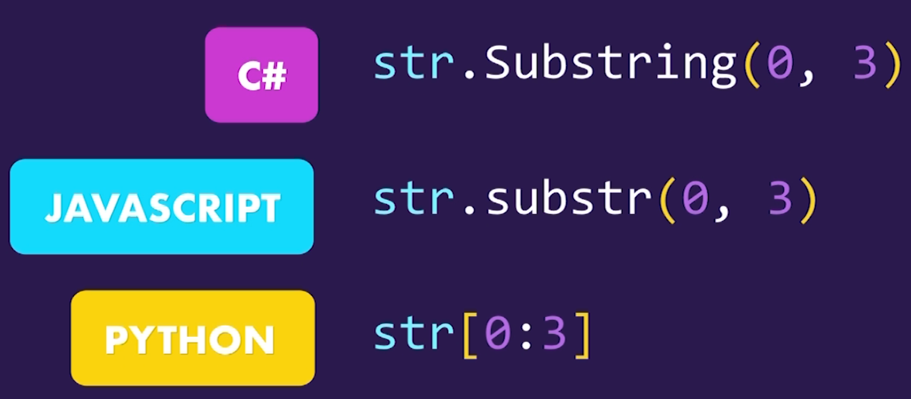
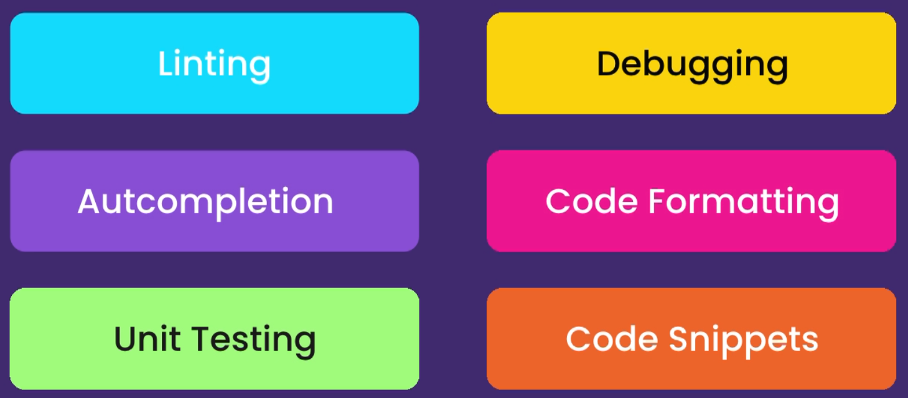
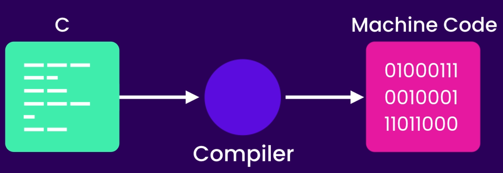
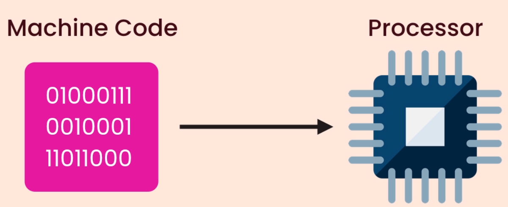
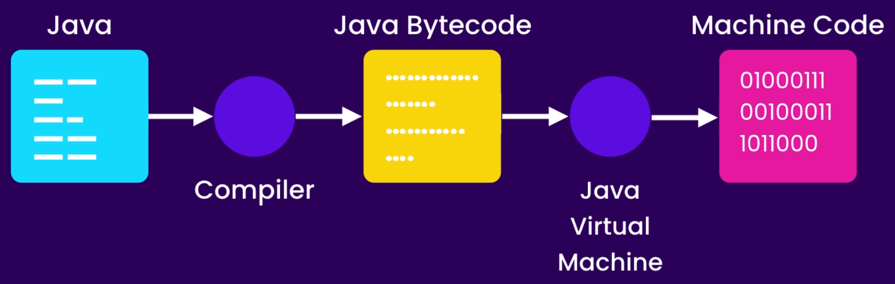
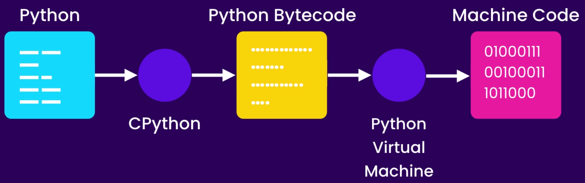
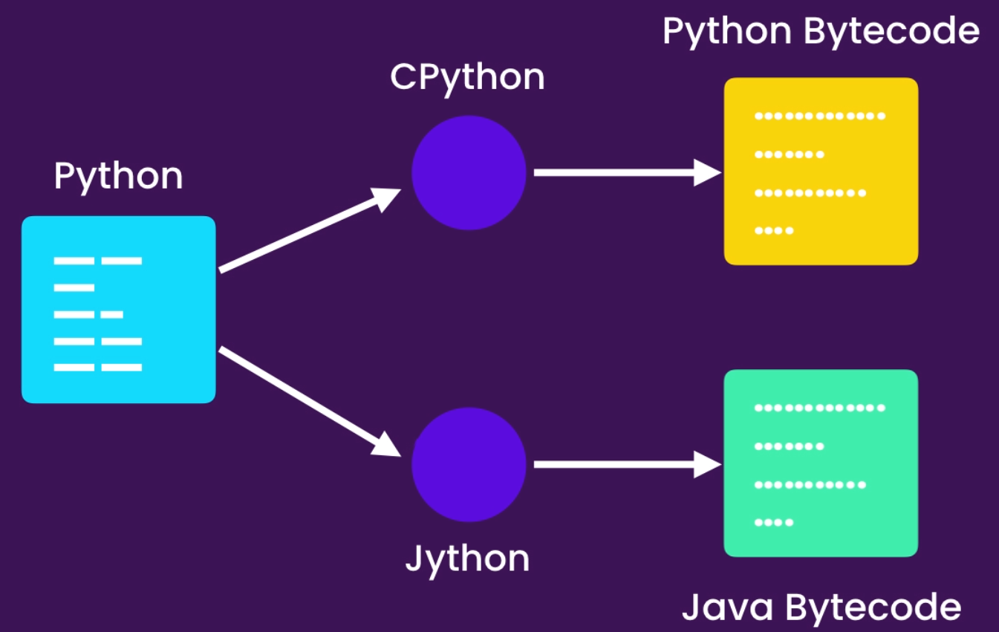

# Python-class2

A Python Programing full Crash cours in Kadoos EDU

# Python

### A Python Programing full Crash cours in Kadoos EDU

### Getting started

- About Python

  - The World's Fastest growing programming language
  - Most Popular among Software Engi., Data Analysts, Math, Science, Net Engi., and Kids
  - Google, Facebook, Spotify, DropBox, and etc. use Python
  - Python is simple
  - 
  -
  - Python is a multipurpose Language
  -
  - 
  -
  - Most Desirable language
  - 
  -
  - Python2 and Python3
  -

- Installation Instruction

  - Install python (Download and install)
  - Note "check `Add python 3 to PATH`"
  - check your installation on windows Command prompt

- Python Interpreter

  - Check some code in it
  - Check errors

- Editors

  - Text Editors `Notepad` , `Atom`, `Sublime`
  - IDEs `Pycharm`,
  - Use `VSCode` for this class

- Create Your First Python File

  - Open your folder in VSCode And create .py file
  - Talk about extensions
  - First Built-in Function `Print()`
  - Execute first code in terminal

- Turn VSCode to a Powerful IDE Using Extensions

  - Install python Extension in VSCode
  - 
  - Install Linter to find Potential errors
  - Select right Python for your Project

- PyLint

  - Check PyLint Functionality
  - Check errors in problems panel
  - Talk about command pallet `Shift + ctrl + p`
  - Choose Right linter - `pylint`

- Python Enhancement Proposal

  - PEPs In google
  - PEP8
  - Talk about Python code formats
  - Format Document In command pallet
  - autopep8 Installation
  - Talk about some developer mistake in formatting code
  - Turn auto format on save in `Code>Preferences>sittings`
  - Search for FormatOnSave and turn it on

- Running Python Code

  - Install Code Runner
  - Running Code by Key or `ctrl+alt+n`

- Python Implementation

  - Cpython and python interpreter
  - Other Implementations of python Jython, IronPython, PyPy
  - These implementations help us to use other languages code in our python code

- Execution of Python code

  - Cpython and python interpreter
  -
  - C Translation to machine code
  - - 
  - Codes are different in Mac and Windows based on compliers
  -
  - - 
  -
  - Java Solve the problem
  -
  - - 
  -
  - Python use it
  - - 
  -
  - Jython Workflow
  -
  - - 

- Variables

  - Core concept of storing data by programming languages
  - Three different built-in primitive types in python
  - Numbers (100, 4.9,...), Booleans (True/False), Strings ("Your Name")
  - All your variables' name should be descriptive and meaningful
  - All letters in your variable's name should be in lower case
  - Set a space before and after your equal sign
  - Use Underline between separate word

- Strings

  - Surround your text with `"` or `'`
  - For multiline text (long text) we use `"""`
  - Talk about built-in function for String type
  - `len()`
  - Calling Functions concept by using `()`
  - Indexing concept in Python for strings and `[]`
  - End of the string using `[-1]`
  - Slicing strings Using `[:]` (check all options)
  - Using backslash `\` to scape special characters (e.g. `\"`, `\'`, `\\`, `\n`)
  - Concatenate strings using `+`
  - Formatted Strings using `f` and `{}`

- String Methods

  - Talk about methods and OOP (Dot Notation)
  - `upper()`, `lower()`, and `title()` methods
  - Notice that the original string is not changed after using those methods
  - Use `strip()` method for users input strings (`lstrip()` and `rstrip()`)
  - Use `find()` method to find a special character or series of characters (return an index or `-1`)
  - Use `replace("1", "2")` to change one or sequence of characters
  - `in` and `not in` expressions for checking the existence of something
  - Different between the `find()` and `in` expression is in return value (`index`, `True/False`)

- Numbers

  - There is three different number type in python
  - `Integer`, `float`, and `complex` (a + bi)
  - Talk about comments `#`

- Standard Arithmetic Operations

  - `+`, `-`, `*`, `/`, `//`, `%` and `**`
  - Augmented Operations `=+`

- Built-in Functions for Numbers

  - `round()`
  - `abs()`
  - Talk about modules (`math`) and import the library and check `.` notation
  - Check `math` modules in Google (`Python 3 math modules`)

- Type Conversion
  - Use input function to get data from user
  - Check the error and explain the reason
  - Built-in Conversion methods in python
  - `int()`, `float`, `bool`, and `str`
  - talk about `type()` method
  - All falsy values in python: `""`, `0`, and `None`
