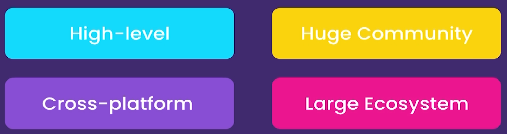

# Python-class2

A Python Programing full Crash cours in Kadoos EDU

# Python

### A Python Programing full Crash cours in Kadoos EDU

### Getting started

- About Python

  - The World's Fastest growing programming language
  - Most Popular among Software Engi., Data Analysts, Math, Science, Net Engi., and Kids
  - Google, Facebook, Spotify, DropBox, and etc. use Python
  - Python is simple
  - 
  -
  - Python is a multipurpose Language
  -
  - 
  -
  - Most Desirable language
  - 
  -
  - Python2 and Python3
  -

- Installation Instruction

  - Install python (Download and install)
  - Note "check `Add python 3 to PATH`"
  - check your installation on windows Command prompt

- Python Interpreter

  - Check some code in it
  - Check errors

- Editors

  - Text Editors `Notepad` , `Atom`, `Sublime`
  - IDEs `Pycharm`,
  - Use `VSCode` for this class

- Create Your First Python File

  - Open your folder in VSCode And create .py file
  - Talk about extensions
  - First Built-in Function `Print()`
  - Execute first code in terminal

- Turn VSCode to a Powerful IDE Using Extensions

  - Install python Extension in VSCode
  - 
  - Install Linter to find Potential errors
  - Select right Python for your Project

- PyLint
  - Check PyLint Functionality
  - Check errors in problems panel
  - Talk about command pallet `Shift + ctrl + p`
  - Choose Right linter - `pylint`
  -
