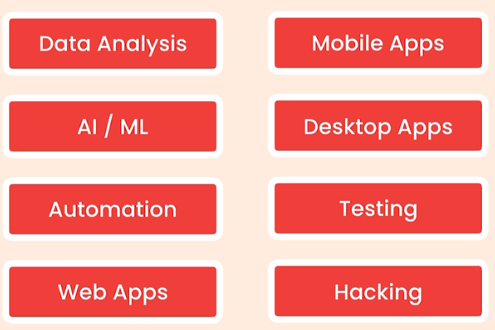

# Python-class2

A Python Programing full Crash cours in Kadoos EDU

# Python

### A Python Programing full Crash cours in Kadoos EDU

### Getting started

- About Python

  - The World's Fastest growing programming language
  - Most Popular among Software Engi., Data Analysts, Math, Science, Net Engi., and Kids
  - Google, Facebook, Spotify, DropBox, and etc. use Python
  - Python is simple
  - 
  -
  - Python is a multipurpose Language
  -
  - 
  -
  - Most Desirable language
  - 
  -
  - Python2 and Python3
  -

- Installation Instruction

  - Install python (Download and install)
  - Note "check `Add python 3 to PATH`"
  - check your installation on windows Command prompt

- Python Interpreter

  - Check some code in it
  - Check errors

- Editors

  - Text Editors `Notepad` , `Atom`, `Sublime`
  - IDEs `Pycharm`,
  - Use `VSCode` for this class

- Create Your First Python File

  - Open your folder in VSCode And create .py file
  - Talk about extensions
  - First Built-in Function `Print()`
  - Execute first code in terminal

- Turn VSCode to a Powerful IDE Using Extensions

  - Install python Extension in VSCode
  - 
  - Install Linter to find Potential errors
  - Select right Python for your Project

- PyLint

  - Check PyLint Functionality
  - Check errors in problems panel
  - Talk about command pallet `Shift + ctrl + p`
  - Choose Right linter - `pylint`

- Python Enhancement Proposal

  - PEPs In google
  - PEP8
  - Talk about Python code formats
  - Format Document In command pallet
  - autopep8 Installation
  - Talk about some developer mistake in formatting code
  - Turn auto format on save in `Code>Preferences>sittings`
  - Search for FormatOnSave and turn it on

- Running Python Code

  - Install Code Runner
  - Running Code by Key or `ctrl+alt+n`

- Python Implementation

  - Cpython and python interpreter
  - Other Implementations of python Jython, IronPython, PyPy
  - These implementations help us to use other languages code in our python code

- Execution of Python code

  - Cpython and python interpreter
  -
  - C Translation to machine code
  - - 
  - Codes are different in Mac and Windows based on compliers
  -
  - - 
  -
  - Java Solve the problem
  -
  - - 
  -
  - Python use it
  - - 
  -
  - Jython Workflow
  -
  - - 

### Primitive Types

- Variables

  - Core concept of storing data by programming languages
  - Three different built-in primitive types in python
  - Numbers (100, 4.9,...), Booleans (True/False), Strings ("Your Name")
  - All your variables' name should be descriptive and meaningful
  - All letters in your variable's name should be in lower case
  - Set a space before and after your equal sign
  - Use Underline between separate word

- Strings

  - Surround your text with `"` or `'`
  - For multiline text (long text) we use `"""`
  - Talk about built-in function for String type
  - `len()`
  - Calling Functions concept by using `()`
  - Indexing concept in Python for strings and `[]`
  - End of the string using `[-1]`
  - Slicing strings Using `[:]` (check all options)
  - Using backslash `\` to scape special characters (e.g. `\"`, `\'`, `\\`, `\n`)
  - Concatenate strings using `+`
  - Formatted Strings using `f` and `{}`

- String Methods

  - Talk about methods and OOP (Dot Notation)
  - `upper()`, `lower()`, and `title()` methods
  - Notice that the original string is not changed after using those methods
  - Use `strip()` method for users input strings (`lstrip()` and `rstrip()`)
  - Use `find()` method to find a special character or series of characters (return an index or `-1`)
  - Use `replace("1", "2")` to change one or sequence of characters
  - `in` and `not in` expressions for checking the existence of something
  - Different between the `find()` and `in` expression is in return value (`index`, `True/False`)

- Numbers

  - There is three different number type in python
  - `Integer`, `float`, and `complex` (a + bi)
  - Talk about comments `#`

- Standard Arithmetic Operations

  - `+`, `-`, `*`, `/`, `//`, `%` and `**`
  - Augmented Operations `+=`, `-=`, `*=`, `/=`

- Built-in Functions for Numbers

  - `round()`
  - `abs()`
  - Talk about modules (`math`) and import the library and check `.` notation
  - Check `math` modules in Google (`Python 3 math modules`)

- Type Conversion
  - Use input function to get data from user
  - Check the error and explain the reason
  - Built-in Conversion methods in python
  - `int()`, `float`, `bool`, and `str`
  - talk about `type()` method
  - All falsy values in python: `""`, `0`, `False`, and `None`
  - Check in interpreter

### Control Flow 

- Comparison Operators

  - `>`, `<`, `<=` `>=`, `==`, `!=`
  - An integer and a string value save differentially in memory `10 == "10"` is wrong
  - every character has unique numeric representation ()unicode, so `"bag" == "BAG"` is wrong
  - Use `ord()` function to show differences

- Conditional statement

  - `if` statement (always terminate it with `:`)
  - Explain about code block and indentation on a simple example `temperature`
  - Simple example (`if statement : pass`)
  - Talk about indentation and code block with example of three print under an if statement
  - Explain codes out of if block
  - With `elif` statement we can add more condition to our code
  - If all our conditions are not True we use `else` statement to execute last condition (lots of `elif` and one `else`)
  - nested if statements

- Ternary Operator

  - Turn 5 line code to one
  - `X = elem1 if rule1 else elem2`
  - message = "OK" if time >= 10 else "Not OK"

- Logical Operator

  - `and`, `or`, and `not`
  - `and` operator return True if both conditions are True
  - `or` operator return True if one of conditions is True
  - `not` changes the value of a boolean variable
  - Don't use `==` for check a boolean variable
  - Separate conditions logical comparison to make accurate comparison
  - Avoid short circuit in the process of working with logical operators
  - Chain logical operators instead of using theme in word format
  - Use `18 <= age < 40` instead of `age >= 18 and age < 40`

- For Loops

  - When we need to repeat a task for number of times `For loop' can do it (Ex: print something for 10 times)
  - Talk about counter(`number`) and `range` function (step) and add `... * "."`

- For...else

  - `else` execute when a loop completely was executed and aBreak didn't happen

- Nested Loops

  - Talk about Outer and inner Loops
  - Explain how exactly python interpreter execute nested loops

- Iterables

  - Use type for range() function to explain
  - Range is complex type
  - Iterable of strings or lists
  - You can create a `iterable` object and use it in `For` loop

- While Loop

  - We use `While` loop to repeat something as log as a condition is true
  - Explain While loop in python interpreter as real world example
  - Simulate Terminal using a while loop as extra example
  - Check case sensitive characteristic of python
  - Check a poor way of condition for while loop (A `and` B)

- Infinite Loop

  - Infinite loop is a loop that runs forever
  - You should always have a way to break the infinite loop
  - it can cause crash for your system

- Exercise/span>
  - A python code that shows even number between 1 to 10 and count them

### Functions

- How to Define a Function

  - In programming we should break our code in small, reusable, and more maintainable chunks of code
  - Use `def` keyword (short form of define) to declare your function
  - Make sure your function names are meaningful and descriptive
  - Name conventions should apply for functions naming
  - After definition of a function for using it you should call it (Two line break - pep8)

- Arguments

  - Talk about differences between `print` and our function
  - Define parameters in our function
  - A parameter is the input that you define for your function but an argument is actual value for a given parameter

- Types of Functions

  - There is two type of Functions
  - A: A function that perform a task (`say_hello()`, `print()`)
  - B: A function that calculate and return a value (`round()`)
  - We use `return` statement to return a value from a function
  - Write `say_hello()` function with `return` and get it in variable
  - Talk about print a function that doesn't return any value
  - By default all functions return a `None` value (indicator of absence a value)

- Keyword Arguments

  - Talk about temporary argument that python create for us when we pass a function to another function
  - Make your code more readable when you are calling your function by using keyword arguments
  - By adding a default value to a parameter we can make it optional
  - (`Important`) All optional parameters should come after the required parameters

- xargs

  - To pass a list of parameters to function we can use `xargs`
  - It returns a `Tuple`
  - By adding an asterisk (`*`) at beginning of a parameter it can take a list of values
  - Talk about tuples and lists by return xargs argument

- xxargs

  - To pass a series of keyword arguments to a function we can use `xxargs` parameter
  - By adding double asterisk (`**`) at beginning of a parameter it can take a list of key value peers
  - It returns a `Dictionary`
  - By using `bracket` notation we can get the values of a dictionary

- Scope
  - It's Impossible to call a variable which defined inside a function, outside of it
  - A local variable only works inside the scope
  - Thc completely equal variable in two different function is completely separate
  - When a function called, python interpreter allocate a memory to it's variables and release it at end function's execution
  - On the other side we have global variables which can be used anywhere in code
  - Global use memory for long time and you should not use them often
  -
